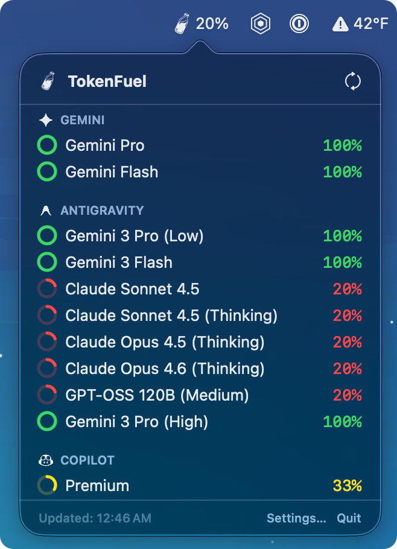

# TokenFuel

TokenFuel is a native macOS menu bar application designed to help you track your usage quotas for various AI coding assistants. It provides a quick, at-a-glance view of your remaining limits for tools like GitHub Copilot, Antigravity, and Google Gemini.

## Key Features

*   **Unified Dashboard:** Monitor multiple AI providers in a single, clean menu bar interface.
*   **Visual Quota Tracking:** See your usage percentages with intuitive progress rings.
*   **Multi-Provider Support:**
    *   **GitHub Copilot:** Tracks Chat and Premium interaction limits.
    *   **Antigravity (Codeium):** Monitors usage by connecting to your local language server.
    *   **Gemini Code Assist:** Displays quotas for Pro and Flash models.
*   **Customizable:** Choose between a unified menu bar icon or separate icons for each provider.
*   **Native & Secure:** Written in Swift/SwiftUI. Credentials are stored securely in the macOS Keychain or read directly from your local environment.

## Getting Started

### Prerequisites

To get data from your providers, you generally need to be signed into them on your machine:
*   **Copilot:** You can sign in directly within the app.
*   **Antigravity:** Requires the Antigravity app to be running on your machine.
*   **Gemini:** Requires authentication via the Gemini CLI (`gemini auth login`).

### Installation

1.  Clone this repository.
2.  Open `TokenFuel.xcodeproj` in Xcode.
3.  Build and run the application.

*Note: For development, you may need to configure a `Secrets.xcconfig` file for API client IDs (see `Secrets.xcconfig.example`).*

## Usage

Once running, TokenFuel sits in your menu bar.
*   **Left-click** the icon to view detailed quota stats, reset times, and access settings.
*   **Settings:** Toggle provider visibility, switch display modes, and manage notifications.

## Privacy

TokenFuel runs entirely locally. It communicates directly with the official APIs of the providers you use or reads status from their local processes on your machine. Your data is not sent to any third-party servers.
